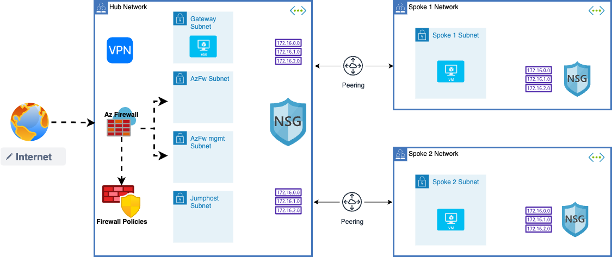

### Overview On Hub And Spoke Network Topology 

        A hub and spoke network topology is a common architecture used in cloud computing to connect multiple virtual networks. In this setup, a central virtual network acts as the "hub," with multiple other virtual networks, or "spokes," connecting to it. Each spoke is isolated from the other spokes, and all traffic between spokes must pass through the hub.

        To implement this topology using firewalls, we recommend using a firewall appliance in the hub virtual network to manage traffic between spokes. This can help ensure that traffic between spokes is only permitted when it meets certain criteria, such as originating from a trusted source.

        It's also important to use separate subscriptions for each virtual network to enhance security and limit potential damage in case of a security breach in one virtual network. This approach also helps to prevent unauthorized access between virtual networks.

        To get started, we suggest creating a hub virtual network and one or more spoke virtual networks in separate subscriptions. You can then use Azure Firewall to manage traffic between the spokes, as well as implement security measures such as intrusion detection and prevention, and application-level filtering.

sudo tcpdump icmp

4.227.247.143
10.1.0.68
10.2.0.68

PasSWord-123